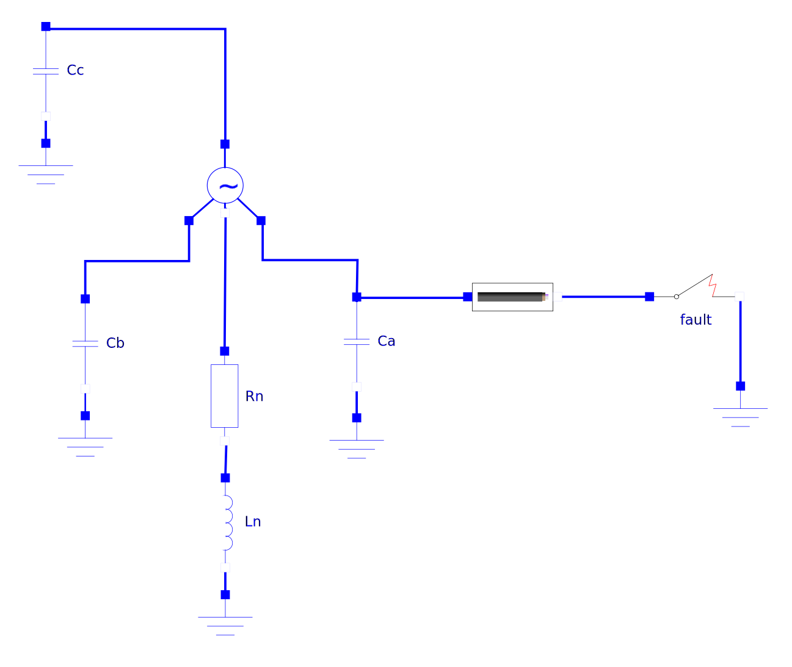

```yaml script=scriptloader
- lib/tinytimer.js
```

```yaml script=dataloader
xml: UrbanPrimary_init.xml
```

<style media="screen" type="text/css">
.form-horizontal .control-label {
  width: 200px;
}
.form-horizontal .controls {
  margin-left: 220px;
}
</style>

## Transient Simulations on an Urban Primary

This app models transients that occur on urban systems during a single
line-to-ground fault. See section 14.2.3 for more information. Adjust
parameters, and the simulation will run automatically. You'll need a
recent version of Firefox (fastest) or Chrome.

<br/>




```yaml jquery=jsonForm class="form-horizontal input-small" name=frm
schema:
  faultTime:
    type: string
    title: Time of the fault [cycles]
    default: 1.25
  kVll:
    type: string
    title: RMS system voltage [kV]
    default: 13.8
  MVA:
    type: string
    title: Transformer MVA
    default: 50.0
  Xpcnt:
    type: string
    title: Transformer impedance [%]
    default: 15.0
  Ntran:
    type: string
    title: Number of transformers
    default: 3
  XRtran:
    type: string
    title: Transformer X/R ratio
    default: 5.0
  Rcable:
    type: string
    title: Cable resistance [ohms]
    default: 0.05
  Xcable:
    type: string
    title: Cable reactance [ohms]
    default: 0.05
  Ccables:
    type: string
    title: Capacitance per phase [uF]
    default: 1.0
  Xneutral:
    type: string
    title: Neutral reactance [ohms]
    default: 1.0
  XRneutral:
    type: string
    title: Neutral reactor X/R ratio
    default: 5.0
form:
  - "*"
params:
  fieldHtmlClass: input-medium
```

```js
if (typeof(isRunning) == "undefined") isRunning = false

if (typeof(timer) != "undefined") {clearInterval(timer.interval); timer = null};
$xml = $(xml)

// Set the default simulation parameters
defex = $xml.find("DefaultExperiment")

// Set some model parameters
$xml.find("ScalarVariable[name = 'faultTime']").find("Real").attr("start", faultTime)
$xml.find("ScalarVariable[name = 'Vll']").find("Real").attr("start", kVll * 1e3)
$xml.find("ScalarVariable[name = 'VA']").find("Real").attr("start", MVA * 1e6)
$xml.find("ScalarVariable[name = 'Xpcnt']").find("Real").attr("start", Xpcnt)
$xml.find("ScalarVariable[name = 'Ntran']").find("Real").attr("start", Ntran)
$xml.find("ScalarVariable[name = 'Xneutral']").find("Real").attr("start", Xneutral)
$xml.find("ScalarVariable[name = 'XRneutral']").find("Real").attr("start", XRneutral)
$xml.find("ScalarVariable[name = 'Rcable']").find("Real").attr("start", Rcable)
$xml.find("ScalarVariable[name = 'Xcable']").find("Real").attr("start", Xcable)
$xml.find("ScalarVariable[name = 'Ccables']").find("Real").attr("start", Ccables * 1e-6)

// Write out the initialization file
xmlstring = new XMLSerializer().serializeToString(xml)

$("#statustext").html(' Simulation running')
$("#statustimer").html("");
$('#statustimer').tinyTimer({ from: Date.now() });

timer = $("#statustimer").data("tinyTimer")

// Start the simulation!
basename = "UrbanPrimary"

if (typeof(wworker) != "undefined" && isRunning) wworker.terminate()
if (typeof(wworker) == "undefined" || isRunning) wworker = new Worker(basename + ".js")
isRunning = true

wworker.postMessage({basename: basename, xmlstring: xmlstring})
wworker.addEventListener('error', function(event) {
});

```

<div id="status" style="text-align:center"><span id="statustext">
Simulation loading</span>. &nbsp Time: <span id="statustimer"> </span></div>


## Results

<div id="yaxisform"> </div>

```js
// read the csv file with the simulation results

wworker.addEventListener("message", function(e) {
    $("#statustext").html(e.data.status)
    timer.stop();
    isRunning = false
    x = $.csv.toArrays(e.data.csv, {onParseValue: $.csv.hooks.castToScalar})

    // `header` has the column names. The first is the time, and the rest
    // of the columns are the variables.
    header = x.slice(0,1)[0]

    $("#plotdiv").calculate();

}, false);

```

```js id=plotdiv
if (typeof(header) != "undefined") {
    y1idx = header.indexOf("Va");
    y2idx = header.indexOf("Vb");
    y3idx = header.indexOf("Vc");
    y4idx = header.indexOf("Vs");
    xidx = 0;
    // pick out the column to plot
    series1 = x.slice(1).map(function(x) {return [x[xidx], x[y1idx]];});
    series2 = x.slice(1).map(function(x) {return [x[xidx], x[y2idx]];});
    series3 = x.slice(1).map(function(x) {return [x[xidx], x[y3idx]];});
    series4 = x.slice(1).map(function(x) {return [x[xidx], x[y4idx]];});
    plot([series1, series2, series3]);
    plot([series4]);
}
```

## Description


This model shows overvoltages on an urban primary system that feeds
load that is fed from delta-wye transformers. Because load is all
connected line to line, the ground mode has some interesting
transients during faults. Customers do not see these overvoltages, but
primary equipment, including cables and splices, does see these
overvoltages.

In addition to section 14.2.3, see these references:

- [EPRI 1009528](http://my.epri.com/portal/server.pt?Abstract_id=000000000001009528),
  Impact of Transients on the Performance of Paper-Insulated
  Lead-Covered (PILC) Cable Systems: Phase 1: Analysis of Follow-On
  Faults, Electric Power Research Institute, Palo Alto, CA, 2004.

- [EPRI 1012924](http://my.epri.com/portal/server.pt?Abstract_id=000000000001012924),
  Program on Technology Innovation: Impact of Transients on the
  Performance of Paper-Insulated Lead-Covered (PILC) Cable Systems,
  Electric Power Research Institute, Palo Alto, CA, 2005.

The capacitance in the diagram is that due to all cables on all
feeders on that phase. See section 4.4.4 for more information on cable
capacitance. Here are some capacitance values for common
urban cables:

- 500 kcmil, 175-mil insulation, XLPE: 0.113 uF/1000 ft
- 750 kcmil, 175-mil insulation, XLPE: 0.135 uF/1000 ft
- 500 kcmil, 345-mil insulation, XLPE: 0.066 uF/1000 ft
- 750 kcmil, 345-mil insulation, XLPE: 0.077 uF/1000 ft

Multiply the numbers above by 1.3 for EPR. 

- 500 kcmil, 175-mil insulation, PILC: 0.164 uF/1000 ft
- 750 kcmil, 175-mil insulation, PILC: 0.195 uF/1000 ft
- 500 kcmil, 345-mil insulation, PILC: 0.097 uF/1000 ft
- 750 kcmil, 345-mil insulation, PILC: 0.113 uF/1000 ft

The key variables are the reactor size (largely determines the
overvoltage), the cable capacitance, and the X/R ratios (determines
damping).

The line model between the substation and the fault is a
resistance and inductance in series. (Better results might be obtained
with a more accurate frequency-dependent line model.) Note that these
impedances represent the loop impedance (2*Z1 + Z0)/3. 

## Background

This simulation model is from a [Modelica](http://modelica.org) model.
See [UrbanPrimary.mo](UrbanPrimary.mo) for the Modelica file you can
run in [OpenModelica](http://openmodelica.org), a free and open-source
modeling tool with a model compiler and graphical interface. Use
OpenModelica (or another Modelica tool) if you want to change modeling
components and explore in more detail. Modelica is a descriptive
language with component and system libraries for simulating
electrical, thermal, and mechanical systems.

OpenModelica was used to compile this model to C. Then,
[Emscripten](http://emscripten.org/) was used to compile the C code to
JavaScript. The user interface was created in
[mdpad](http://tshort.github.io/mdpad/). See
[UrbanPrimary.md](UrbanPrimary.md) for the Markdown code for this
page.
