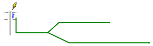

## Transients on underground cables

This app models transients from lightning on a single-phase
underground cable with a split (section 13.6.3).



<br/>

<!-- Script loader -->

```yaml
          #: script=scriptloader
- OpenETran.js
```

<!-- OpenETran input data template -->

```text
          #: name=inputtemplate
* adapted from openetran/Test/scout.dat
time 2 0.01e-6 14.0e-6

* overhead line geometry
span 1
conductor 1 10.0  0.0 0.00715 0.0
conductor 2  8.0  0.0 0.00715 0.0

* single-phase underground attached to upper phase
span 2
cable 1 30.0 1.7e8 0.0
end
end

* overhead line spans
line 1 2 1 60.0 1 0
line 2 3 1 60.0 0 0
line 3 4 1 60.0 0 0
line 4 5 1 60.0 0 1
* underground spans - section 1
line  3  6 2 SECTIONLEN1 0 0
line  6  7 2 SECTIONLEN1 0 0
line  7  8 2 SECTIONLEN1 0 0
line  8  9 2 SECTIONLEN1 0 0
line  9 10 2 SECTIONLEN1 0 0
line 10 11 2 SECTIONLEN1 0 0
line 11 12 2 SECTIONLEN1 0 0
line 12 13 2 SECTIONLEN1 0 0
line 13 14 2 SECTIONLEN1 0 0
line 14 15 2 SECTIONLEN1 0 0
* underground spans - section 2
line 15 16 2 SECTIONLEN2 0 0
line 16 17 2 SECTIONLEN2 0 0
line 17 18 2 SECTIONLEN2 0 0
line 18 19 2 SECTIONLEN2 0 0
line 19 20 2 SECTIONLEN2 0 0
line 20 21 2 SECTIONLEN2 0 0
line 21 22 2 SECTIONLEN2 0 0
line 22 23 2 SECTIONLEN2 0 0
line 23 24 2 SECTIONLEN2 0 0
line 24 25 2 SECTIONLEN2 0 0
* underground spans - section 3
line 15 26 2 SECTIONLEN3 0 0
line 26 27 2 SECTIONLEN3 0 0
line 27 28 2 SECTIONLEN3 0 0
line 28 29 2 SECTIONLEN3 0 0
line 29 30 2 SECTIONLEN3 0 0
line 30 31 2 SECTIONLEN3 0 0
line 31 32 2 SECTIONLEN3 0 0
line 32 33 2 SECTIONLEN3 0 0
line 33 34 2 SECTIONLEN3 0 0
line 34 35 2 SECTIONLEN3 0 0
end

* riser pole and scout arresters
arrester 0.0e3 RISERVOLTAGE 0.28 0.4e-6 LEADLEN
pairs 1 0
poles 3

surge  20.0e3 0.5e-6 50.0e-6 0.0e-6
pairs 1 0
poles 3

meter
pairs 1 0
poles all
```

<!-- Input form -->

```yaml
          #: jquery=dform
class : form
html:
  - type: div
    class: row
    html:
      - type: div
        class: col-md-4
        html:
          - name: LEADLEN
            type: number
            step: 1.0
            bs3caption : "Lead length at the riser pole, ft"
            value: 0.0
      - type: div
        class: col-md-4
        html:
          - name: RISERVOLTAGE
            type: number
            step: 5.0
            bs3caption : "Riser-arrester discharge voltage, kV"
            value: 30.0
  - type: div
    class: row
    html:
      - type: div
        class: col-md-4
        html:
          - name: CABLELEN1
            type: number
            step: 50.0
            bs3caption : "Section 1 cable length, ft"
            value: 100.0
      - type: div
        class: col-md-4
        html:
          - name: CABLELEN2
            type: number
            step: 50.0
            bs3caption : "Section 2 cable length, ft"
            value: 800.0
      - type: div
        class: col-md-4
        html:
          - name: CABLELEN3
            type: number
            step: 50.0
            bs3caption : "Section 3 cable length, ft"
            value: 500.0
```

<!-- Create input file and run the simulation -->

```js
    if (CABLELEN1 < 30) CABLELEN1 = 30
    if (CABLELEN2 < 30) CABLELEN2 = 30
    if (CABLELEN3 < 30) CABLELEN3 = 30
    inputdata = inputtemplate.replace("RISERVOLTAGE", 1000.0 * RISERVOLTAGE)
    inputdata = inputdata.replace("LEADLEN", LEADLEN)
    inputdata = inputdata.replace(/SECTIONLEN1/g,  1/10.0/3.28 * CABLELEN1)
    inputdata = inputdata.replace(/SECTIONLEN2/g,  1/10.0/3.28 * CABLELEN2)
    inputdata = inputdata.replace(/SECTIONLEN3/g,  1/10.0/3.28 * CABLELEN3)
    Module.FS_createDataFile("/", "file.dat", inputdata, true, true)
    Module["arguments"] = ["-plot", "csv", "file"]
    Module['calledRun'] = false;
    shouldRunNow = true;
    Module.run();
    out = intArrayToString(FS.findObject("/file.out").contents);
    csv = intArrayToString(FS.findObject("/file.csv").contents);
    FS.unlink("/file.dat");    // delete the input file
    FS.unlink("/file.out");    // delete the output files
    FS.unlink("/file.csv");
```

<br/>
<div class = "row">
<div class = "col-md-6">
    Animation of voltages, kV
    <div id="animation" style='width:100%; height:25em;'></div>
    <div class="text-center">Distance along the cables, ft</div>
</div>
<div class = "col-md-6">
    Voltages, kV
    <div id="graph" style='width:100%; height:25em;'></div>
    <div class="text-center">Time, &mu;sec</div>
</div>
</div>

<!-- Read the csv file with the simulation results -->

```js

    x = $.csv.toArrays(csv, {onParseValue: $.csv.hooks.castToScalar})

    // `header` has the column names. The first is the time, and the rest
    // of the columns are the variables.
    header = x.slice(0,1)[0]

    // Select graph variables with a select box based on the header values
    if (typeof(graphvar) == "undefined") graphvar = header[1];

```

<!-- Plot -->

```js
    yidx = header.indexOf(graphvar);
    xidx = 0;
    // pick out the column to plot
    series1 = x.slice(1).map(function(x) {return [x[0]*1e6, x[3]/1e3];});
    series2 = x.slice(1).map(function(x) {return [x[0]*1e6, x[15]/1e3];});
    series3 = x.slice(1).map(function(x) {return [x[0]*1e6, x[25]/1e3];});
    series4 = x.slice(1).map(function(x) {return [x[0]*1e6, x[35]/1e3];});
    ymin = 1.05 * _.min(x.map(function(xx) {return _.min(xx);}))/1000;
    ymax = 1.05 * _.max(x.map(function(xx) {return _.max(xx);}))/1000;
    $.plot($('#graph'),
              [series2, series3, series4, series1],
              { xaxis: { min: 0, max: 1e6 * x[x.length-1][0]},
                yaxis: { min: ymin, max: ymax } });
```

<!-- Animation -->

```js
var nstep = 0
var plot = $.plot($('#animation'),
              [{ data: [[0.0, 0.0], [30.0, 0.0]] }],
              { xaxis: { min: 0, max: +CABLELEN1 + Math.max(+CABLELEN2, +CABLELEN3)},
                yaxis: { min: ymin, max: ymax } });
$('#animation').stop()
$('#animation').animate( {tabIndex: 0}, {
   duration: 25000,
   step: function ( now, fx ) {
      nstep = nstep + 2
      if (nstep < x.length) {
          var z = x[nstep]
          series1 = x[nstep].slice(5,16).map(function(xx, i) {return [(i)*CABLELEN1/10, xx/1e3];});
          series1[0] = [0,x[nstep][3]/1000];
          series2 = x[nstep].slice(15,26).map(function(xx, i) {return [+CABLELEN1 + i*CABLELEN2/10, xx/1e3];});
          //series3 = [series2[0]].concat(x[nstep].slice(26).map(function(xx, i) {return [+CABLELEN1 + (i+1)*CABLELEN3/10, xx/1e3];}));
          series3 = x[nstep].slice(25).map(function(xx, i) {return [+CABLELEN1 + (i+1)*CABLELEN3/10, xx/1e3];});
          series3[0] = series2[0];
          plot.setData( [series1,series2,series3] );
          plot.draw();
      }
   }
});
```


## Discussions

The second plot shows the cable voltages at the riser pole, the tap
point and at the ends of each tap. The first plot shows an animation
of the cable voltages as the transients propagate along the cables.

This app uses
[EPRI OpenETran](http://sourceforge.net/projects/epri-openetran/) to
simulate the transients on the underground cable system.

Note that this app simplifies some aspects, particularly:

* Attenuation on the cables is not included.
* Effects of flashovers on the overhead line are not included.
* The ac voltage effect is not included.
* The lightning current injection is hard coded at 20 kA with a
  0.5-&mu;sec risetime.
* The arrester uses a simplified, piecewise-linear model.

## Background

[Emscripten](http://emscripten.org/) was used to compile OpenETran's
code to JavaScript. The user interface was created in
[mdpad](http://tshort.github.io/mdpad/). See
[here](cable_transients.md) for the code with the user interface and
[OpenETran](http://sourceforge.net/projects/openetran/) model input.
OpenETran and the GNU GSL library (an OpenETran dependency) are
distributed under the
[GNU GPL version 3.0 license](https://www.gnu.org/copyleft/gpl.html).
The source codes are available as follows:
[OpenETran](https://svn.code.sf.net/p/openetran/code/) and
[GNU GSL](http://ftpmirror.gnu.org/gsl/http://gnu.mirrorcatalogs.com/gsl/gsl-1.15.tar.gz).
