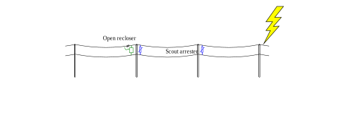

## Lightning protection of a recloser

This example models a section of overhead line with an **open** recloser.
Scout arresters, placed on poles on either side of the
recloser pole, are optional. This example is for the situation where a first lightning stroke
causes a flashover, the recloser opens, then a subsequent stroke hits the line.

The plot shows the voltages at the recloser pole.



<!-- Script loader -->

```yaml
         #: script=scriptloader
- OpenETran.js
```

<!-- Input data template -->

```text
         #: name=inputtemplate
2 3 SPAN 1 0 2e-8 0.000005

* overhead line geometry
conductor 1 10.0  0.8 0.00715
conductor 2  8.0  0.0 0.00715

* scout arrester
arrester 0.0e3 SCOUTVOLTAGE 0.28 0.4e-6 SCOUTLEADLEN
pairs 1 2
poles 2

* scout ground
ground 50 250 400e3 5e-7 10 
pairs 2 0
poles 2

* recloser arrester
arrester 0.0e3 RECLOSERVOLTAGE 0.28 0.4e-6 RECLOSERLEADLEN
pairs 1 2
poles 3

* recloser ground
ground 50 250 400e3 5e-7 10 
pairs 2 0
poles 3

surge -15.0e3 0.5e-6 50.0e-6 0.0e-6
pairs 1 0
poles 1

meter
pairs 1 2
poles 3
```

<div class = "row">
<div class = "col-md-5">

<!-- Input form -->

```yaml
         #: jquery=dform
class : form
html:
  - name: userecloserarrester
    type: checkbox
    checked: checked
    bs3caption: Use recloser arresters
  - name: RECLOSERVOLTAGE
    type: number
    step: 5.0
    bs3caption : "Recloser arrester discharge voltage, kV"
    value: 40.0
    css:
      width: 13em
  - name: RECLOSERLEADLEN
    type: number
    step: 1.0
    bs3caption : "Lead length for the recloser arrester, ft"
    value: 10.0
    css:
      width: 13em
  - name: scouts
    type: checkbox
    bs3caption: Use scout arresters
  - name: SCOUTVOLTAGE
    type: number
    step: 5.0
    bs3caption : "Scout arrester discharge voltage, kV"
    value: 40.0
    css:
      width: 13em
  - name: SCOUTLEADLEN
    type: number
    step: 1.0
    bs3caption : "Lead length for the scout arrester, ft"
    value: 10.0
    css:
      width: 13em
  - name: SPAN
    type: number
    step: 50.0
    bs3caption : "Distance between poles, ft"
    value: 200.0
    css:
      width: 13em
```

</div>
<div class = "col-md-7">

<!-- Generate input file and run the simulation -->

```js
    if (!userecloserarrester) {RECLOSERVOLTAGE = 10000}
    if (!scouts) {SCOUTVOLTAGE = 10000}
    inputdata = inputtemplate.replace("SCOUTVOLTAGE", 1000.0 * SCOUTVOLTAGE)
        .replace("SCOUTLEADLEN", SCOUTLEADLEN / 3.28)
        .replace("RECLOSERVOLTAGE", 1000.0 * RECLOSERVOLTAGE)
        .replace("RECLOSERLEADLEN", RECLOSERLEADLEN / 3.28)
        .replace(/SPAN/g, 1/3.28 * SPAN)
    Module.FS_createDataFile("/", "file.dat", inputdata, true, true)
    Module["arguments"] = ["-plot", "csv", "file"]
    Module['calledRun'] = false;
    shouldRunNow = true;
    Module.run();
    out = intArrayToString(FS.findObject("/file.out").contents);
    csv = intArrayToString(FS.findObject("/file.csv").contents);
    FS.unlink("/file.dat");    // delete the input file
    FS.unlink("/file.out");    // delete the output files
    FS.unlink("/file.csv");
```

<h2>Results</h2>

<!-- Read the csv file with the simulation results -->

```js

    x = $.csv.toArrays(csv, {onParseValue: $.csv.hooks.castToScalar})

    // `header` has the column names. The first is the time, and the rest
    // of the columns are the variables.
    header = x.slice(0,1)[0]

    // Select graph variables with a select box based on the header values
    if (typeof(graphvar) == "undefined") graphvar = header[1];

```

Recloser voltage, kV

<!-- Plot results -->

```js
    yidx = header.indexOf(graphvar);
    xidx = 0;
    // pick out the column to plot
    series = [{label: "Recloser",
               data: x.slice(1).map(function(x) {return [x[0]*1e6, x[1]/1e3];})}];
    plot(series, {legend: {noColumns: 3, container: $("#legend")}});
```
<div class="text-center">Time, &mu;sec</div>
<div id="legend"/>

</div>
</div>


## Discussions

This app uses
[EPRI OpenETran](http://sourceforge.net/projects/epri-openetran/) to
simulate the transients.

Note that this app simplifies some aspects, particularly:

* Effects of flashovers on the overhead line are not included.
* The ac voltage effect is not included.
* The lightning current injection is hard coded at -15 kA with a 0.5-usec risetime.
* The arresters use a simplified, piecewise-linear model.

Also, this app does not consider BIL nor does it calculate
protective margins.

## Background

[Emscripten](http://emscripten.org/) was used to compile OpenETran's
code to JavaScript. The user interface was created in
[mdpad](http://tshort.github.io/mdpad/). See
[here](lightning-cable.md) for the code with the user interface and
[OpenETran](http://sourceforge.net/projects/openetran/) model input.
OpenETran and the GNU GSL library (an OpenETran dependency) are
distributed under the
[GNU GPL version 3.0 license](https://www.gnu.org/copyleft/gpl.html).
The source codes are available as follows:
[OpenETran](https://svn.code.sf.net/p/openetran/code/) and
[GNU GSL](http://ftpmirror.gnu.org/gsl/gsl-1.15.tar.gz).
