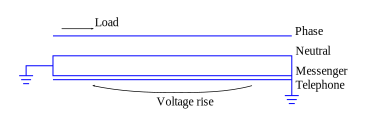

# Voltage rise on telephone circuits from a single-phase line

This app models the voltage rise from unbalanced load on an overhead
distribution line that couples into a telephone system. The four
conductors modeled are illustrated below.




The neutral and messenger are ideally grounded, meaning that there is
no voltage gradient along them. The telephone cable is grounded at
the remote end and floating at the start of the circuit.

<!-- Script loader -->

```yaml
         #: script=scriptloader
- lib/numeric-1.2.6.min.js
- lib/math.min.js
```

<!-- Conductor data -->

```yaml
         #: name=d
rac: [3.551, 2.232, 1.402, 1.114, 0.882, 0.7, 0.556, 0.441, 0.373, 0.35, 0.311, 0.278, 0.267, 0.235, 0.208, 0.197, 0.188, 0.169, 0.135, 0.133, 0.127, 0.12, 0.109, 0.106, 0.101, 0.0963]
gmr: [0.0055611962035177, 0.00700459393067038, 0.00882262274842038, 0.00990159326021141, 0.0111125174323268, 0.0124715326552536, 0.0139967498560307, 0.0157084948536593, 0.0171990576740366, 0.0177754680514267, 0.0197856043349646, 0.0209605660328388, 0.0214852445181602, 0.0227611387971986, 0.0243123406199979, 0.0249209197027924, 0.0255447325512619, 0.0270616982108416, 0.0308759703782212, 0.0311314761296609, 0.0319107497292355, 0.0327095298674806, 0.0343675751093677, 0.0349387277474913, 0.0361096666226405, 0.0367097709735484]
conductors: [6 AAC, 4 AAC, 2 AAC, 1 AAC, 1/0 AAC, 2/0 AAC, 3/0 AAC, 4/0 AAC, 250 AAC, 266.8 AAC, 300 AAC, 336.4 AAC, 350 AAC, 397.5 AAC, 450 AAC, 477 AAC, 500 AAC, 556.5 AAC, 700 AAC, 715.5 AAC, 750 AAC, 795 AAC, 874.5 AAC, 900 AAC, 954 AAC, 1000 AAC]
```

<!-- Conductor data for the messenger -->

```yaml
         #: name=dm
rac: [6.8112, 4.6464, 3.5904, 2.270]
gmr: [7.016e-06, 2.623e-05, 5.071e-05, 0.0001363]
conductors: ['3/8" EHS steel', '7/16" EHS steel','1/2" EHS steel','5/8" EHS steel']
```

<!-- Input form -->

```yaml
         #: jquery=dform
class : form
html:
  - type: div
    class: row
    html:
      - type: div
        class: col-md-3
        html:
          - name: I
            type: number
            step: 5
            min: 0.0
            bs3caption : Phase current, A
            value: 30
      - type: div
        class: col-md-3
        html:
          - name: len
            type: number
            step: 1.0
            min: 0.0
            bs3caption : Line length, miles
            value: 10.0
      - type: div
        class: col-md-3
        html:
          - name: rho
            type: number
            step: 25.0
            min: 0.0
            bs3caption : Earth resistivity, ohm-m
            value: 100.0
  - type: h6
    html: Conductor heights in feet
  - type: div
    class: row
    html:
      - type: div
        class: col-md-3
        html:
          - name: Hphase
            type: number
            step: 1.0
            bs3caption : "Phase"
            value: 30.0
      - type: div
        class: col-md-3
        html:
          - name: Hneutral
            type: number
            step: 1.0
            bs3caption : "Neutral"
            value: 25.0
      - type: div
        class: col-md-3
        html:
          - name: Hmessenger
            type: number
            step: 1.0
            bs3caption : "Messenger"
            value: 20.4
      - type: div
        class: col-md-3
        html:
          - name: Hphone
            type: number
            step: 0.2
            bs3caption : "Phone"
            value: 20.0
  - type: h6
    html: Conductor sizes
  - type: div
    class: row
    html:
      - type: div
        class: col-md-3
      - type: div
        class: col-md-3
        html:
          - name: neutral
            type: select
            bs3caption : "Neutral"
            selectvalue: 2/0 AAC
            choices: [6 AAC, 4 AAC, 2 AAC, 1 AAC, 1/0 AAC, 2/0 AAC, 3/0 AAC, 4/0 AAC, 250 AAC, 266.8 AAC, 300 AAC, 336.4 AAC, 350 AAC, 397.5 AAC, 450 AAC, 477 AAC, 500 AAC, 556.5 AAC, 700 AAC, 715.5 AAC, 750 AAC, 795 AAC, 874.5 AAC, 900 AAC, 954 AAC, 1000 AAC]
      - type: div
        class: col-md-3
        html:
          - name: messenger
            type: select
            bs3caption : "Messenger"
            selectvalue: '3/8" EHS steel'
            choices: ['3/8" EHS steel', '7/16" EHS steel','1/2" EHS steel','5/8" EHS steel']
```


## Results

<!-- Main calculations -->

```js

sq = function(x) {
  return x * x;
}

nidx = _.map(d.conductors, String).indexOf(neutral)
midx = _.map(dm.conductors, String).indexOf(messenger)

cond = {}
cond.R = []
cond.gmr = []
cond.y = []
cond.ngrnd = 0       // number of grounded conductors -- always the last conductors
cond.y = [Hphase, Hneutral, Hmessenger, Hphone]        // ft
cond.x = [0, 0, 0, 0]
for (var i = 0; i < 4; i++) {
    cond.R[i]   = d.rac[nidx]   // ac resistance, ohms/mi
    cond.gmr[i] = d.gmr[nidx]   // ft
}
cond.R[2]   = d.rac[midx]   // ac resistance, ohms/mi
cond.gmr[2] = d.gmr[midx]   // ft


calcZ = function(cond) {
    n = cond.R.length
    Z = numeric.t(numeric.identity(n), numeric.identity(n))
    f = 60     // Hz
    k1 = 0.2794 * f / 60  // for answers in ohms/mi
    Re = 0.0954 * f / 60
    De = 2160 * math.sqrt(rho / f)
    for (var i = 0; i < n; i++) {
        Z.x[i][i] = cond.R[i] + Re
        Z.y[i][i] = k1 * math.log10(De / cond.gmr[i])
        if (i < n)
            for (var k = i + 1; k < n; k++) {
                dik = math.sqrt(sq(cond.y[i] - cond.y[k]) + sq(cond.x[i] - cond.x[k]))
                Z.x[i][k] = Re
                Z.y[i][k] = k1 * math.log10(De / dik)
                Z.x[k][i] = Z.x[i][k]
                Z.y[k][i] = Z.y[i][k]
            }
    }
    // Eliminate grounded wires
    if ( cond.ngrnd > 0 ) {
      np = n - cond.ngrnd
      Z = Z.getBlock([0, 0], [np-1, np-1]).sub(
          Z.getBlock([0, np], [np-1, n-1]).dot(Z.getBlock([np, np], [n-1, n-1]).inv()).dot(Z.getBlock([np, 0], [n-1, np-1])))
    }
    return Z
}
Z = calcZ(cond).mul(len)
A = Z.getBlock([1,1], [2,2])
b = Z.getBlock([1,0], [2,0]).mul(-I)
Inm = A.inv().dot(b)
Ix = numeric.t([[I],[0],[0]], [[0],[0],[0]])
Ix.setBlock([1,0], [2,0], Inm)
V = Z.getBlock([0,3], [2,3]).transpose().dot(Ix)

//Inm = numeric.solve(Z.getBlock([1,1],[2,2]), Z.getBlock([1,3], [2,3]).mul(-I).transpose())
println("Neutral current   = " + numeric.prettyPrint(math.round(Inm.abs().x[0][0])) + " A")
println("Messenger current = " + numeric.prettyPrint(math.round(Inm.abs().x[1][0])) + " A")
println(" ")
println("Voltage rise on the phone circuits = " + math.round(V.abs().x[0][0]) + " V")
```

## References

IEEE 776-1992. *Recommended Practice for Coordination of Electric
Supply and Communication Lines*.

IEEE 1137-1991. *Guide for the Implementation of Mitigation
Techniques*.

M. Loftness, *AC Power Interference Handbook*, 2ed, Percival
Technology, distributed by the American Radio Relay League (ARRL),
2003.


## Notes

This can approximate coupling on two- or three-phase line if you use
the residual current (vector sum of all phases) as input for the phase
conductor.

If the voltage on the phone cables gets too high, phones can ring
nonstop. This problem is rare. It occurs on long, unbalanced circuits.
See IEEE 776 and IEEE 1137 for solution options. For line-to-ground
faults on the distribution circuit, the coupled voltage can be
significant. Model this by entering the fault current as the
load current value.

For impedances, this app uses a simple implementation of the equations
outlined in section 2.4. The frequency is fixed at 60 Hz. For more
sophisticated line modeling and voltage drop calculations, see
[OpenDSS](http://www.smartgrid.epri.com/SimulationTool.aspx) or a
transient program like [EMTP-RV](http://emtp.com) or
[ATP](http://emtp.org).
