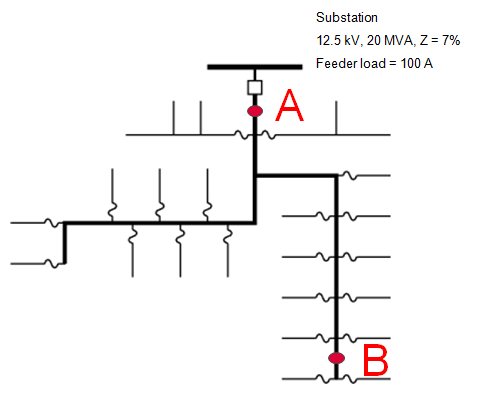

# 8. Faults

## Questions

0. A fault at location B is measured as 1 kA. For this event, how much
   current is measured at location A?  
   
   
   
   1. 7 kA
   2. 3 kA
   3. 1 kA
   4. 0\.5 kA
   
0. If you are one mile from a 12.5-kV substation, which answer is
   likely closest to the available L-G fault current?
   
   1. 7\.0 kA
   2. 3\.5 kA
   3. 1\.5 kA
   
0. On a 12-kV circuit, what’s a typical line-to-ground fault current 4
   miles from the substation?
   
   1. 200 A
   2. 500 A
   3. 1500 A
   4. 2500 A
   
0. On a 25-kV circuit, what’s a typical line-to-ground fault current 4
   miles from the substation?
   
   1. 200 A
   2. 500 A
   3. 1500 A
   4. 2500 A
   
0. Which of the following helps reduce high-impedance faults? Mark all
   that apply.

   1. Faster relaying
   2. Fuse taps
   3. Use covered wire
   4. Stronger conductors

0. On a 25-kV circuit that's 4 miles from the substation, which has
   the lowest current?
   
   1. Line-to-ground fault
   2. Line-to-line fault
   3. Line-to-line-to-ground fault
   4. Three-phase fault

0. For a line-to-ground fault on the secondary side of a delta to wye
   transformer, what is the primary line current?
   
   1. About 58% on two phases 
   2. 115% on one phase
   3. 100% on one phase and the neutral/earth return

0. On an overhead system, which is more likely?

   1. 80% of faults are permanent
   2. 60% of faults are temporary
   
0. A digital relay measures a fault current of 8 kA. Where is the
   fault likely to be?

   1. Close to the station
   2. About 3 miles out
   3. More than 5 miles out
   4. Need more information
   
0. Arcs tend to travel?

   1. Towards the source
   2. Away from the source
   
0. Which of these are likely to cause temporary faults (rather than
   permanent).
   
   1. Trees
   2. Animals
   3. Both

0. If an arc has a voltage of 1000 V, about how long is that arc?
   Assume open air.

   1. 2 in
   2. 1 ft 
   3. 3 ft
   4. 10 ft

0. For a circuit with an X/R ratio of 10, when is the asymmetry worst?

   1. When the fault happens when the voltage is near zero.
   2. When the fault happens when the voltage is near peak.
   3. When the fault happens when the voltage is about 50% and increasing.
   4. When the fault happens when the voltage is about 50% and decreasing.

0. True/false: for an open fuse feeding a three-phase customer,
   backfeed voltages can appear on the open phase, but only with a
   delta to wye connection.

   1. True
   2. False
   
0. True/false: to protect customer equipment from damage from primary
   faults into the secondary, smaller, fast transformer fuses are better.

   1. True
   2. False

0. Faster relaying helps with which of the following? Mark all that
   apply.
   
   1. Conductor slapping
   2. Tree faults
   3. Evolving faults
   4. Insulator damage

0. When using station-class arresters on distribution circuits to
   protect customers against overbuilt to underbuilt faults, which of
   the following are true? Mark all that apply.
   
   1. Station arresters are used because they have a higher energy
      rating, so they can handle energies involved.
   2. Station arresters have a lower clamping voltage than other
      arresters on the circuit.
   3. Isolators are not used, because we want the arresters to stay in
      the circuit.

0. Which is likely to be the most energetic failure? (Assume the
   durations are the same.)

   1. Fault in a transformer
   2. Fault in a cable
   3. Fault in a splice
   
0. Fault location using substation data tends to be more accurate for
   which of the following. Mark all that apply.

   1. Faults past 3 miles because load currents are less 
   2. Faults closer to the substation
   3. Tree faults (relative to other fault types)
   4. Underground systems 

0. For a line-to-ground fault on the secondary side of a delta --
   grounded-wye transformer that is 10 per unit (relative to the
   full-load rating of the transformer), what is the fault current on
   the primary side?

   1. 0 per unit
   1. 5.8 per unit
   1. 10 per unit
   
   
## Problems

1. Using the impedances in tables 2.7 and 2.8, calculate the
   following bolted fault currents:

   - Line to ground
   - Line to line
   - Three phase
   
   Circuit parameters include:
   
   - Fault location = 2 miles from the substation
   - Voltage = 12.5 kV
   - Substation transformer: 20 MVA OA rating, 9% impedance,
     X/R = 10
   - Peak feeder load current = 400 A
   - Phase conductors = 336-kcmil AAC
   - Neutral conductor = 2/0 AAC

0. Calculate the line-to-ground fault currents for problem #1 using a 1-ohm arc resistance.

0. Calculate the line-to-ground fault currents for problem #1 using a 1 kV arc voltage.

0. Calculate the line-to-ground fault currents for problem #1 using a 40-ohm arc resistance.

0. For 1" x 3/8" busbar, calculate the length of copper bus melted for
   a 20-kA fault for 1 sec.
   
   

## Projects

0. Fault app

   Build a spreadsheet app, web/JavaScript app, or R/Matlab app for
   plotting fault currents based on user inputs.

0. Youtube downed conductors

   Look on youtube or other internet video sites, and find and
   document three cases of downed wires, and identify the cause as
   best you can as well as any options that might have prevented it.
