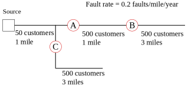
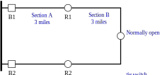

## 9. Short-Circuit Protection

# Questions

0. Will a 50-K fuse operate to clear most energized downed wires at
   12.5 kV?
   
   1. Yes
   2. No
   
0. Will a 25-K fuse operate to clear most energized downed wires at
   12.5 kV?
   
   1. Yes
   2. No
   
0. What is the most common fault impedance?
   
   1. 1 ohm
   2. 20 ohms
   3. 40 ohms
   4. 10,000 ohms
   
0. What is the best value for worst-case fault impedance?
   
   1. 1 ohm
   2. 20 ohms
   3. 40 ohms
   4. 10,000 ohms

0. Is cold-load pickup only an issue in the winter?
   
   1. Yes
   2. No

0. Which of the following devices clear at a zero crossing of
   the current? Mark all that apply.

    1. Circuit breakers
    1. Reclosers
    1. Current-limiting fuses
    1. Expulsion fuses

0. Which relay curve most naturally coordinates with K link fuses?

    1. Moderately inverse 
    1. Very inverse
    1. Extremely inverse

0. For a 100 K, tin fuse at 12.5 kV, what is the maximum clearing time
   for a current of 1000 A (pick the closest)?

    1. 300 sec
    2. 10 sec
    3. 1.0 sec
    4. 0.4 sec
    5. undefined

0. For a 100 T, tin fuse at 25 kV, what is the maximum clearing time for a
   current of 1000 A (pick the closest)?

    1. 300 sec
    2. 10 sec
    3. 1.0 sec
    4. 0.4 sec
    5. undefined

0. For a 100 K, tin fuse, what is the maximum clearing time for a
   current of 160 A? Pick the closest.

    1. 300 sec
    2. 10 sec
    3. 1.0 sec
    4. 0.1 sec
    5. undefined

0. What determines the maximum fault magnitude that an expulsion fuse
   can clear?

    1. The fuse amperage rating
    2. Whether it is a dual-element or single-element fuse
    3. The fuse tube
    4. Preheating

0. Which of the following fuses are acceptable on a 50-kVA transformer
   at 7.2 kV (L-N)? Mark all that apply.
   
    1. 20 K
    2. 12 K
    3. 10 K
    4. 8 K
    2. 12 T
    3. 10 T
    4. 8 T

0. In a high lightning area, which of the following fuses is preferred
   on a 50-kVA transformer at 7.2 kV (L-N)?
   
    1. 20 K
    2. 12 K
    3. 10 K
    4. 8 K
    2. 12 T
    3. 10 T
    4. 8 T

0. For a CLF transformer with an fuse, are current-limiting fuses
   advisable two miles from the substation on a 25-kV system?

   1. Yes
   2. No

0. For an 80K tap fuse, at which of the following locations on a
   distribution feeder will the fast trip by the substation breaker
   coordinate to successfully save the fuse? Assume a six-cycle
   (0.1-sec) clearing time. Mark all that apply.

    1. 1.0 miles from the substation
    1. 2.0 miles from the substation
    1. 4.0 miles from the substation
    1. 8.0 miles from the substation

0. At 12.5 kV, what's the minimum delay time for reclosing to allow sufficient
   time for arcs to deionize?

   1. 12 cycles
   1. 30 cycles
   1. 60 cycles

0. An expulsion fuse may clear in 0.25 cycles.

   1. True
   1. False

# Problems

0. Using a time-current plotting program (Milsoft Windmill, ), plot the burndown line for a
   3/0 ACSR covered conductor (see chapter 2). Add the clearing curve
   for a 100 K fuse. Is the wire protected from burndown?

0. Repeat for the following combinations:
   0. 3/0 ACSR covered, 200-A L recloser (C curve)
   0. 3/0 ACSR bare, 100 K fuse
   0. 3/0 ACSR bare, 200-A L recloser (C curve)
   0. \#2 ACSR bare, WVE electronic recloser, minimum operating current = 560 A, curve = 138

0. Consider the three candidate recloser locations in the figure
below. Using Duke Power’s “Fundamental Law of Sectionalizing”,
determine the following for each recloser location: the customer
interruptions saved, the dollars per customer interruption saved, and
the total value of each recloser.

   

0. Consider the looped circuit below with a manually operated tie
switch. How many customers would need to be in section A to justify
upgrading the tie point to an automated device? Assume the both
circuits are mirrors of each other. Assume a fault rate of 0.2
faults/mi/yr.

   

0. You have a 2-mile, three-phase tap with 80 customers. Should you
   fuse it or use single-phase reclosers? Use Duke’s “Fundamental Law
   of Sectionalizing” and their default costs. Assume 0.2 permanent
   faults per mile and 0.4 temporary faults per mile annually. Assume
   fuse saving is not an option.

0. Consider a 12.5-kV circuit protected by a Cooper WVE recloser with
   a minimum operating current of 560 A. Using each of the following
   methods, determine how many miles from the substation you need to
   put the next recloser. Assume one ohm per mile of line impedance
   and a one ohm substation impedance.
   
   1. Use 50% of the bolted fault current
   1. Assume fault impedance = 2 ohms
   1. Assume fault impedance = 20 ohms
   1. Assume fault impedance = 40 ohms

0. Find the minimum size neutral reactor (in ohms) needed to ensure
   fuse saving coordination for the entire circuit for 100 T fuses for
   a 12.5-kV substation with a bolted fault current of 8 kA at the
   substation. Assume a six-cycle clearing time (0.1 sec).

0. If a circuit with fuse saving averages 14 momentary interruptions
   per year, calculate many will there be if the circuit is switched
   to fuse blowing. Assume that 70% of the circuit exposure is
   downstream of fused taps.

0. What phase and ground instantaneous pickup settings (GE IAC-77
   relay) should you use to avoid instantaneous operations for trips
   downstream of a WVE hydraulic recloser 4 miles from the substation
   on a 12.5-kV circuit? Assume the circuit characteristics in Fig.
   8.11 (10-kA phase and ground fault current at the substation, Z1 =
   0.207 + j0.628 ohms/mi, Z0 = 0.72 + j1.849 ohms/mi).

# Projects

0. Make a spreadsheet or other tool to evaluate fuse saving and fuse blowing.

